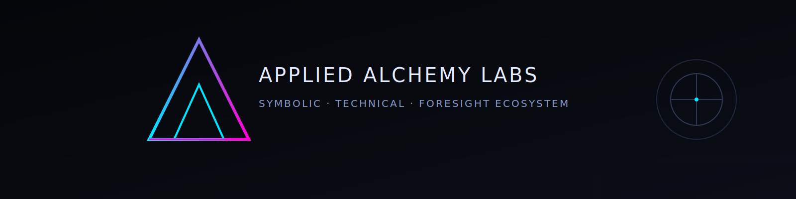
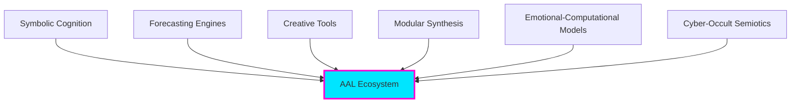

<div align="center">



# Applied Alchemy Labs
### Ecosystem Specification & Architecture Overview

[](LICENSE)
[](CHANGELOG.md)
[](docs/)
[]()

**Symbolic · Technical · Foresight Ecosystem**

[📖 Documentation](#documentation) • [🎯 Modules](#aal-module-constellation) • [🔮 Standards](#symbolic-standards) • [📜 Canon](canon/) • [🤝 Contributing](docs/governance/contribution-guidelines.md)

**Version:** 1.1
**Maintainer:** Daniel K. Meyer / Applied Alchemy Labs
**License:** MIT

</div>

---

## 🎯 Purpose of This Repository

This repository defines the **AAL Ecosystem Specification**: a public, high-level description of the conceptual, symbolic, and technical architecture of Applied Alchemy Labs.

### Five Core Functions

<table>
<tr>
<td width="50%">

**🔐 Conceptual Authorship**
Establish conceptual authorship of AAL frameworks, terminology, doctrines, and system design

**📚 Unified Reference**
Provide a unified reference for all AAL modules and their interoperability

**📜 Canonical Standards**
Publish and version binding canonical documents governing system behavior

</td>
<td width="50%">

**🌱 Open Foundation**
Offer a stable foundation for future open-source contributions and documentation

**⏰ Intellectual Protection**
Protect the intellectual footprint of AAL through timestamped publication and explicit licensing

</td>
</tr>
</table>

> **Note:** This repository contains **documentation only** — no proprietary code, credentials, heuristics, model weights, or production pipelines.

---

## 🧬 What Is Applied Alchemy Labs?

Applied Alchemy Labs (AAL) is an ecosystem of **symbolic-technical systems** designed to unify:

<div align="center">



</div>

AAL operates as a **constellation of interoperable modules**, all compatible with AAL-Core and the ABX-Runes symbolic computation layer.

### 💎 Guiding Thesis

> **"Meaning, prediction, creativity, and intelligence are expressions of a shared underlying coherence structure that can be modeled, constrained, and executed."**

---

## 🏗️ Core Architectural Principles

### 🎛️ 1. Modular Eurorack Architecture

```
┌─────────────┐     ┌─────────────┐     ┌─────────────┐
│   Module A  │────▶│  AAL-Core   │◀────│   Module B  │
│  (Abraxas)  │     │   Hub       │     │ (BeatOven)  │
└─────────────┘     └─────────────┘     └─────────────┘
                           │
                    ResonanceFrame
                       Schema
```

All AAL modules follow a Eurorack-style modular design philosophy:

- ✅ Systems are separate processes, not monoliths
- ✅ Each module exposes explicit input/output ports
- ✅ Interoperability through shared schema (ResonanceFrame)
- ✅ Added complexity must reduce entropy or improve efficiency

---

### 🔒 2. ABX-Core Hardening

| Principle | Description |
|-----------|-------------|
| **Deterministic Execution** | Predictable behavior where possible |
| **Provenance Embedding** | Track data origins and decisions |
| **Typed Op-Checks** | Validate inputs and outputs |
| **Capability Sandboxing** | Limited, defined permissions |
| **Golden Tests** | Ensure consistency over time |
| **Measured Complexity** | Reductions in compute, time, cost, or entropy |

---

### 🌱 3. SEED Framework Enforcement

The default operating posture across AAL emphasizes:

<table>
<tr>
<td align="center" width="25%"><b>S</b><br/>Structured Intent</td>
<td align="center" width="25%"><b>E</b><br/>Entropy Minimization</td>
<td align="center" width="25%"><b>E</b><br/>Ethical Boundaries</td>
<td align="center" width="25%"><b>D</b><br/>Deterministic Constraints</td>
</tr>
</table>

- Intention clarity
- Deterministic boundaries
- Entropy minimization
- Symbolic coherence
- Reliable provenance
- Predictable behavior across modules

---

### 🔮 4. ABX-Runes Symbolic Engine

ABX-Runes is a shared symbolic interpreter powering all AAL modules:

```
┌──────────────────────────────────────┐
│         ABX-Runes Layers             │
├──────────────────────────────────────┤
│  Layer 3: DBI Agent (Future)         │
│  Layer 2: System-Wide Shim           │
│  Layer 1: In-Process JIT             │
└──────────────────────────────────────┘
```

**Capabilities:**
- Forecasting
- Narrative-semiotic modeling
- Emotional vectors
- Runic overlays
- Sigil generation
- Cross-module symbolic transmission

---

### 📜 5. AAL Modular Design Doctrine (Binding Canon)

> **NEW IN v1.1:** AAL's generative, musical, and symbolic systems are governed by a versioned canonical doctrine.

**[AAL Modular Design Doctrine v1.0](canon/modular-design-doctrine-v1.0.md)**

This doctrine establishes **binding laws** including:

<table>
<tr>
<td width="50%">

**Symbolic & Magical Layer:**
- 🎵 Music as operative symbolic action
- 🔮 Ritual lifecycle enforcement (PREP → THRESHOLD → PEAK → RELEASE → SEAL)
- 🔐 Mandatory sealing and termination semantics
- 🌊 Space as first-class modulatable process
- 🎲 Bounded chaos (intent first, chaos gated)
- ♾️ Bounded infinity (feedback with containment)

</td>
<td width="50%">

**Execution & Network Layer:**
- 📐 Symbolic templating without semantic loss
- 🧮 Containment complexity budgets
- ⏸️ Suspension as operation (freeze/mute/block)
- 🚫 Forbidden interactions (constraint graphs)
- ⚖️ Pareto-based design tradeoffs
- 👥 Multi-user agency readiness

</td>
</tr>
</table>

**This doctrine binds:** BeatOven, PatchHive, Abraxas overlays, and all future generative instruments.

---

## 🎯 AAL Module Constellation

<div align="center">

### 9 Core Modules · Unified Ecosystem

</div>

<details open>
<summary><h3>🧠 Abraxas Engine</h3></summary>

**The Symbolic Intelligence Kernel**

Abraxas is the primary symbolic intelligence layer, designed to:

- 🔍 Analyze coherence vs. drift in narratives, data streams, and systems
- 🌊 Detect memetic vectors and "meme weather" patterns
- 🔮 Forecast events and symbolic trajectories
- 📜 Generate daily oracles and aesthetic forecasts
- 🎯 Provide meaning-layer for alignment research
- ⚙️ Function as the symbolic kernel underlying the AAL ecosystem

**Key Sub-Components:**
- Oracle Layer (daily, tactical, strategic)
- Symbolic Resonance Engine
- Meme-Weather Engine
- ABX-Runes Integration Layer
- ERS Scheduler (runtime orchestration)
- Adaptive symbolic overlays

[📖 Full Documentation](docs/modules/abraxas.md) · [🏗️ Architecture](docs/architecture/abraxas-kernel.md)

</details>

<details>
<summary><h3>⚡ HollerSports</h3></summary>

**Sports Forecasting & Parlay Engine**

HollerSports features:

- 🎯 Parlay optimizers
- 🏀 Mixed-sport hybrid forecasting
- 📊 Rolling-window analytics and outcome tracking
- 🎢 Ladder and streak modeling
- 🔮 Abraxas symbolic overlays (momentum, pressure, narrative vectors)
- 📈 Conservative / Balanced / Aggressive parlay templates
- 💹 Bettor Console format with simulated ROI %, hit rate, and per-leg probabilities

[📖 Full Documentation](docs/modules/hollersports.md)

</details>

<details>
<summary><h3>🎵 BeatOven</h3></summary>

**Psycho-Sonic Generative System**

> **GOVERNED BY:** [AAL Modular Design Doctrine v1.0](canon/modular-design-doctrine-v1.0.md)

BeatOven is a psycho-sonic generative system that:

- 🎭 Extracts emotional vectors from existing music
- 🎹 Generates stems, MIDI, and CV/Gate structures
- 🔮 Compiles symbolic intent into compressed control surfaces (IntentTokens / Sigils)
- 🔐 Enforces ritualized generation with explicit sealing
- 🌊 Treats space as a core, modulatable, memory-bearing process
- 🎛️ Supports constraint graphs, containment budgets, and suspension operations
- 💫 Aligns emotionally and symbolically with Abraxas

BeatOven serves as a sound-design, scoring, and sonic execution engine across AAL.

[📖 Full Documentation](docs/modules/beatoven.md)

</details>

<details>
<summary><h3>🧘 PsyFi</h3></summary>

**Cognitive & Symbolic UI/UX Engine**

PsyFi provides:

- 🗺️ Introspection tools and guided journeys
- 📊 Symbolic analysis dashboards and maps
- 🌀 Emotional physics and ritual mechanics modeling
- 🎵 BeatOven integration for sound-based feedback
- 🌙 Noctis Engine integration for dream-linked insights

[📖 Full Documentation](docs/modules/psyfi.md)

</details>

<details>
<summary><h3>🎛️ PatchHive</h3></summary>

**Eurorack Patch Design Platform**

> **GOVERNED BY:** [AAL Modular Design Doctrine v1.0](canon/modular-design-doctrine-v1.0.md)

PatchHive is a Eurorack-style patch and module design platform that:

- 📚 Maintains comprehensive modular synth database
- 🖼️ Visualizes patch diagrams
- 🔮 Overlays runic modulation on CV paths
- 📤 Exports symbolic, templated patch topologies
- 🎯 Supports constraint graphs and containment targets
- 🏗️ Acts as the hardware metaphor and executable topology layer for AAL

[📖 Full Documentation](docs/modules/patchhive.md)

</details>

<details>
<summary><h3>🖼️ Phonomicon</h3></summary>

**Sound-to-Art Minting Engine**

Phonomicon converts sound into visual, symbolically enriched artifacts:

- 🎨 Audio → Visual artifact transformation
- 🔗 On-chain provenance and manifest hashing
- 💎 NFT minting with emotional vectors
- ⚡ Runpod GPU-accelerated rendering
- 🔮 Emotion-driven symbolic translation
- ✨ "Proof of Resonance" philosophy
- 🔒 ABX-Core and SEED principles compliance

[📖 Full Documentation](docs/modules/phonomicon.md)

</details>

<details>
<summary><h3>🌙 Noctis Engine</h3></summary>

**Dream Analysis & Tracking**

Noctis Engine provides:

- 📝 Neutral, symbolic parsing of dream reports
- 🎴 Grounded, profile-tuned interpretation
- 🔮 Sigil, meditation theme, and ritual suggestions
- 📖 Grimoire-style archiving
- 🧠 Tight integration with Abraxas for symbolic continuity

[📖 Full Documentation](docs/modules/noctis-engine.md)

</details>

<details>
<summary><h3>🔥 Emberline</h3></summary>

**Recovery & Integration System**

Emberline is a recovery-focused system addressing:

- 🧬 Dopamine and nervous-system repair
- 🌓 Symbolic + biological model synthesis
- 🌙 Noctis Engine integration for dream-based recovery
- 💊 D-LAPS complementary stack
- 🔄 Ritual- and lifestyle-facing tools

[📖 Full Documentation](docs/modules/emberline.md)

</details>

<details>
<summary><h3>💊 D-LAPS</h3></summary>

**Human Performance Ecosystem**

D-LAPS is a human-performance and dopamine-recovery ecosystem including:

**Product Line:**
- D-LAPS Prime capsules
- Neuroflux / Metaflux liposomal formulations
- MetaLean (metabolic support)
- Pulse (cardiovascular)
- Cognitive (nootropic)

**Architecture:**
- Dual-lab architecture (conceptual + compliance-safe real-world lab)
- Translation layer from theory to safe application
- Attached scientific summaries and safety framing

[📖 Full Documentation](docs/modules/d-laps.md)

</details>

---

## 🏗️ AAL-Core Architecture

<div align="center">

```
┌──────────────────────────────────────────────────────┐
│                    AAL Hub                           │
│         (FastAPI Coordination Layer)                 │
├──────────────────────────────────────────────────────┤
│  Module Registry  │  Message Bus  │  Scheduler       │
│  Ritual Envelope  │  Constraint   │  Budget Layer    │
└────────┬─────────────────┬─────────────────┬─────────┘
         │                 │                 │
    ┌────▼────┐       ┌────▼────┐      ┌────▼────┐
    │ Abraxas │       │BeatOven │      │ Noctis  │
    └────┬────┘       └────┬────┘      └────┬────┘
         │                 │                 │
         └─────────────────┴─────────────────┘
                           │
                 ResonanceFrame Schema
```

</div>

### AAL-Core Provides

| Component | Purpose |
|-----------|---------|
| **AAL Hub** | FastAPI coordination layer and message bus |
| **Module Processes** | Independent logical units (Abraxas, BeatOven, Noctis, PsyFi, PatchHive, etc.) |
| **ResonanceFrame Schema** | Shared symbolic + numeric vector format |
| **Ritual Execution Envelope** | Shared lifecycle semantics across modules |
| **Constraint & Budget Layer** | Forbidden interactions, containment budgets, suspension ops |
| **Future Migration Path** | Rust-based scheduler/runtime |
| **Hardware Target** | Particle Tachyon-5 board |

[📖 Architecture Documentation](docs/architecture/)

---

## 🔮 Symbolic Standards

AAL maintains a comprehensive library of symbolic computation standards:

<table>
<tr>
<td width="50%">

### 📜 [Chaos-Sigil Dictionary](docs/symbolic-standards/chaos-sigil-dictionary.md)
Canonical mapping of sigil forms to operational meanings
- Stabilizing Sigils
- Disruptive Sigils
- Liminal Sigils
- Integrative Sigils

### 📈 [Hyperstition Metrics](docs/symbolic-standards/hyperstition-metrics.md)
Track self-fulfilling narratives and meme-realities
- Hyperstition Score formula
- Reality-shaping measurement
- Memetic bootstrap analysis

### 🌫️ [Ambiguity Index](docs/symbolic-standards/ambiguity-index.md)
Measure interpretive spread in narratives
- Low/Medium/High ambiguity scales
- Context resolvability
- Observer consensus tracking

</td>
<td width="50%">

### 🎭 [Carnival Quotient](docs/symbolic-standards/carnival-quotient.md)
Measure chaos, inversion, and carnival energy
- Inversion tracking
- Mockery intensity
- Boundary dissolution
- Play dynamics

### ⏰ [Ritual Timing](docs/symbolic-standards/ritual-timing.md)
Align actions with symbolic moments
- Threshold Moments
- Echo Windows
- Integration Periods
- Pressure Points

### 🎨 [Aesthetic Forecast Format](docs/symbolic-standards/aesthetic-forecast-format.md)
Standardized symbolic aesthetic predictions
- Vector analysis
- Tension mapping
- Motif identification
- Palette recommendations

</td>
</tr>
</table>

### 📜 Additional Binding Standards (v1.1)

- **[AAL Modular Design Doctrine v1.0](canon/modular-design-doctrine-v1.0.md)** 🆕
- **Constraint Graph Standard** 🆕
- **Containment Budget Standard** 🆕
- **Ritual Lifecycle Standard** 🆕
- **Space Operator Standard** 🆕
- **Pareto Tradeoff Documentation Guidelines** 🆕

---

## 📚 Documentation

### 🏗️ Architecture
- [AAL-Core Overview](docs/architecture/aal-core-overview.md)
- [Abraxas Kernel](docs/architecture/abraxas-kernel.md)
- [ABX-Runes System](docs/architecture/abx-runes-overview.md)
- [ResonanceFrame Schema](docs/architecture/resonanceframe-schema.md)
- [Module Interoperability](docs/architecture/module-interoperability.md)

### ⚙️ Governance
- [SEED Framework](docs/governance/seed-framework.md)
- [ABX-Core Hardening](docs/governance/abx-core-hardening.md)
- [Compliance Overview](docs/governance/compliance-overview.md)
- [Contribution Guidelines](docs/governance/contribution-guidelines.md)

### 📜 Canon (Binding Standards)
- [AAL Modular Design Doctrine v1.0](canon/modular-design-doctrine-v1.0.md) 🆕

---

## 📜 Licensing

<table>
<tr>
<td width="50%">

### ✅ What Is Covered

- Documentation and architecture
- Framework definitions
- Module specifications
- Symbolic standards
- Canonical doctrines
- Design patterns

</td>
<td width="50%">

### ❌ What Is NOT Covered

- Proprietary implementation code
- Model weights and heuristics
- Production credentials
- Confidential research notes
- Runtime internals

</td>
</tr>
</table>

**License:** [MIT](LICENSE) – See license file for full terms.

---

## 🤝 Contributing

Contributions must:

- ✅ Respect the MIT License
- ✅ Adhere to ABX-Core and SEED principles
- ✅ **Comply with the AAL Modular Design Doctrine** 🆕
- ✅ **Avoid ungated randomness, unsealed generation, or entropy inflation** 🆕
- ✅ Maintain structural and symbolic coherence
- ✅ Treat symbolic research as valid technical work

**Symbolic work** (semiotics, narrative architecture, cultural dynamics, cognitive schemas, emotional physics) is valued equally with technical contributions.

[📖 Full Contribution Guidelines](docs/governance/contribution-guidelines.md)

---

## 🗺️ Roadmap

<div align="center">

### Planned Public Releases

</div>

| Module | Status | Timeline |
|--------|--------|----------|
| **AAL Modular Design Doctrine v1.0** | ✅ Published | v1.1 |
| AAL-Core scaffolding references | 📝 Planning | TBD |
| Abraxas Kernel documentation | 📝 Planning | TBD |
| PatchHive public module index | 📝 Planning | TBD |
| BeatOven IntentToken & emotional-vector specs | 📝 Planning | TBD |
| Noctis Engine dream schemas | 📝 Planning | TBD |
| D-LAPS scientific summaries | 📝 Planning | TBD |
| Phonomicon conceptual pipeline | 📝 Planning | TBD |

> **Note:** Low-level runtime internals remain private.

---

## ⚠️ Disclaimer

<div align="center">

**AAL is a research ecosystem exploring symbolic cognition, computational semiotics, creative systems, and forecasting.**

This repository and its contents are provided for **informational, educational, and exploratory purposes**.

🚫 Not medical advice · 🚫 Not financial advice · 🚫 No guaranteed outcomes · 🚫 No alignment assurances

</div>

---

## 📞 Contact

<div align="center">

**Daniel K. Meyer**
Applied Alchemy Labs

📧 [dkmeyer1@student.fullsail.com](mailto:dkmeyer1@student.fullsail.com)
📱 213-266-2797

---

<sub>Built with 🔮 by Applied Alchemy Labs · [Documentation](docs/) · [Canon](canon/) · [License](LICENSE) · [Changelog](CHANGELOG.md)</sub>

</div>
