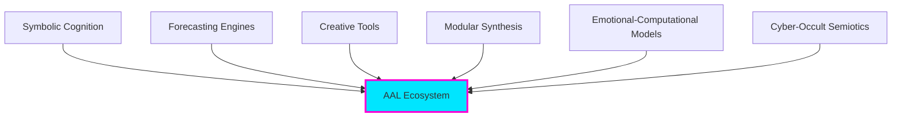

<div align="center">


# Applied Alchemy Labs
### Ecosystem Specification & Architecture Overview

[](LICENSE)
[](CHANGELOG.md)
[](docs/)
[]()

**Symbolic · Technical · Foresight Ecosystem**

[📖 Documentation](#documentation) • [🎯 Modules](#aal-module-constellation) • [🔮 Standards](#symbolic-standards) • [🤝 Contributing](docs/governance/contribution-guidelines.md)

</div>

---

## 🎯 Purpose of This Repository

This repository defines the **AAL Ecosystem Specification**: a public, high-level description of the conceptual, symbolic, and technical architecture of Applied Alchemy Labs.

### Core Functions

<table>
<tr>
<td width="50%">

**🔐 Intellectual Authorship**
Establish conceptual authorship of AAL frameworks, terminology, and system design

**📚 Unified Reference**
Provide a single source of truth for all modules and their interoperability

</td>
<td width="50%">

**🌱 Open Foundation**
Offer a stable foundation for future open-source contributions

**⏰ Timestamped Publication**
Protect intellectual footprint through explicit licensing

</td>
</tr>
</table>

> **Note:** This repo contains **documentation only** — no proprietary code, credentials, or production pipelines.

---

## 🧬 What Is Applied Alchemy Labs?

Applied Alchemy Labs (AAL) is an ecosystem of **symbolic-technical systems** designed to unify:

<div align="center">



</div>

### 💎 Core Thesis

> **"Meaning, prediction, creativity, and intelligence are all expressions of the same deeper coherence structure."**

AAL operates as a **constellation of interoperable modules**, all compatible with AAL-Core and the ABX-Runes symbolic computation layer.

---

## 🏗️ Core Architectural Principles

### 🎛️ Modular Eurorack Architecture

```
┌─────────────┐     ┌─────────────┐     ┌─────────────┐
│   Module A  │────▶│  AAL-Core   │◀────│   Module B  │
│  (Abraxas)  │     │   Hub       │     │ (BeatOven)  │
└─────────────┘     └─────────────┘     └─────────────┘
                           │
                    ResonanceFrame
                       Schema
```

- ✅ Systems are separate processes, not monoliths
- ✅ Each module exposes clear input/output ports
- ✅ Everything interoperates through shared schema
- ✅ Adding complexity must reduce entropy

### 🔒 ABX-Core Hardening

| Principle | Description |
|-----------|-------------|
| **Deterministic Execution** | Predictable behavior where possible |
| **Provenance Embedding** | Track data origins and decisions |
| **Typed Op-Checks** | Validate inputs and outputs |
| **Golden Tests** | Ensure consistency over time |
| **Entropy Reduction** | Complexity must justify itself |

### 🌱 SEED Framework

<table>
<tr>
<td align="center" width="25%"><b>S</b><br/>Structured Intent</td>
<td align="center" width="25%"><b>E</b><br/>Entropy Minimization</td>
<td align="center" width="25%"><b>E</b><br/>Ethical Boundaries</td>
<td align="center" width="25%"><b>D</b><br/>Deterministic Constraints</td>
</tr>
</table>

### 🔮 ABX-Runes Symbolic Engine

A shared symbolic interpreter powering all AAL modules:

```
┌──────────────────────────────────────┐
│         ABX-Runes Layers             │
├──────────────────────────────────────┤
│  Layer 3: DBI Agent (Future)         │
│  Layer 2: System-Wide Shim           │
│  Layer 1: In-Process JIT             │
└──────────────────────────────────────┘
```

---

## 🎯 AAL Module Constellation

<div align="center">

### 9 Core Modules · Unified Ecosystem

</div>

<details open>
<summary><h3>🧠 Abraxas Engine</h3></summary>

**The Symbolic Intelligence Kernel**

Primary functions:
- 🔍 Analyze coherence vs. drift in narratives and systems
- 🌊 Detect memetic vectors and "meme weather" patterns
- 🔮 Forecast events and symbolic trajectories
- 📜 Generate daily oracles and aesthetic forecasts
- 🎯 Provide meaning-layer for alignment research

**Key Components:**
- Oracle Layer (daily, tactical, strategic)
- Symbolic Resonance Engine
- Meme-Weather Engine
- ABX-Runes Integration
- ERS Scheduler

[📖 Full Documentation](docs/modules/abraxas.md) · [🏗️ Architecture](docs/architecture/abraxas-kernel.md)

</details>

<details>
<summary><h3>⚡ HollerSports</h3></summary>

**Sports Forecasting & Parlay Engine**

- 🎯 Parlay optimizers for multi-leg tickets
- 🏀 Mixed-sport hybrid forecasting
- 📊 Rolling-window analytics
- 🎢 Ladder and streak bet modeling
- 🔮 Symbolic overlays from Abraxas

**Risk Templates:** Conservative · Balanced · Aggressive

[📖 Full Documentation](docs/modules/hollersports.md)

</details>

<details>
<summary><h3>🎵 BeatOven</h3></summary>

**Psycho-Sonic Generative System**

- 🎭 Extract emotional vectors from music
- 🎹 Generate stems, MIDI, and CV/Gate
- 🌊 Map emotional resonance to sonic structures
- 🔮 Integrates with Abraxas for symbolic alignment

[📖 Full Documentation](docs/modules/beatoven.md)

</details>

<details>
<summary><h3>🧘 PsyFi</h3></summary>

**Cognitive & Symbolic UI/UX Engine**

- 🗺️ Introspection tools and guided journeys
- 📊 Symbolic analysis dashboards
- 🌀 Emotional physics modeling
- 🎵 BeatOven integration for sonic feedback
- 🌙 Noctis Engine for dream insights

[📖 Full Documentation](docs/modules/psyfi.md)

</details>

<details>
<summary><h3>🎛️ PatchHive</h3></summary>

**Eurorack Patch Design Platform**

- 📚 Comprehensive modular synth database
- 🖼️ Visual patch diagram designer
- 🔮 Runic modulation overlays
- 📤 Exportable patch configurations

[📖 Full Documentation](docs/modules/patchhive.md)

</details>

<details>
<summary><h3>🖼️ Phonomicon</h3></summary>

**Sound-to-Art Minting Engine**

- 🎨 Audio → Visual artifact transformation
- 🔗 On-chain provenance hashing
- 💎 NFT minting with emotional vectors
- ⚡ GPU-accelerated rendering
- 🔮 "Proof of Resonance" framework

[📖 Full Documentation](docs/modules/phonomicon.md)

</details>

<details>
<summary><h3>🌙 Noctis Engine</h3></summary>

**Dream Analysis & Tracking**

- 📝 Symbolic parsing of dream reports
- 🎴 Sigil and meditation generation
- 📖 Grimoire-style archiving
- 🔮 Abraxas integration for continuity

[📖 Full Documentation](docs/modules/noctis-engine.md)

</details>

<details>
<summary><h3>🔥 Emberline</h3></summary>

**Recovery & Integration System**

- 🧬 Dopamine repair modeling
- 🌓 Symbolic + biological synthesis
- 🌙 Noctis integration
- 💊 D-LAPS complementary stack

[📖 Full Documentation](docs/modules/emberline.md)

</details>

<details>
<summary><h3>💊 D-LAPS</h3></summary>

**Human Performance Ecosystem**

**Product Line:**
- D-LAPS Prime (dopamine recovery)
- Neuroflux / Metaflux (liposomal)
- MetaLean (metabolic support)
- Pulse (cardiovascular)
- Cognitive (nootropic)

**Architecture:**
- Conceptual Lab + Compliance Lab
- Translation layer for safety
- Scientific research integration

[📖 Full Documentation](docs/modules/d-laps.md)

</details>

---

## 🏗️ AAL-Core Architecture

<div align="center">

```
┌──────────────────────────────────────────────────────┐
│                    AAL Hub                           │
│         (FastAPI Coordination Layer)                 │
├──────────────────────────────────────────────────────┤
│  Module Registry  │  Message Bus  │  Scheduler       │
└────────┬─────────────────┬─────────────────┬─────────┘
         │                 │                 │
    ┌────▼────┐       ┌────▼────┐      ┌────▼────┐
    │ Abraxas │       │BeatOven │      │ Noctis  │
    └────┬────┘       └────┬────┘      └────┬────┘
         │                 │                 │
         └─────────────────┴─────────────────┘
                           │
                 ResonanceFrame Schema
```

</div>

### Key Components

| Component | Purpose |
|-----------|---------|
| **AAL Hub** | FastAPI coordination layer and message bus |
| **Module Processes** | Independent logical units (Abraxas, Noctis, etc.) |
| **ResonanceFrame** | Shared schema for symbolic + numeric vectors |
| **Future Path** | Migration to Rust for performance |
| **Hardware Target** | Particle Tachyon 5 board deployment |

[📖 Architecture Documentation](docs/architecture/)

---

## 🔮 Symbolic Standards

AAL maintains a comprehensive library of symbolic computation standards:

<table>
<tr>
<td width="50%">

### 📜 [Chaos-Sigil Dictionary](docs/symbolic-standards/chaos-sigil-dictionary.md)
Canonical mapping of sigil forms to operational meanings
- Stabilizing Sigils
- Disruptive Sigils
- Liminal Sigils
- Integrative Sigils

### 📈 [Hyperstition Metrics](docs/symbolic-standards/hyperstition-metrics.md)
Track self-fulfilling narratives and meme-realities
- Hyperstition Score formula
- Reality-shaping measurement
- Memetic bootstrap analysis

### 🌫️ [Ambiguity Index](docs/symbolic-standards/ambiguity-index.md)
Measure interpretive spread in narratives
- Low/Medium/High ambiguity scales
- Context resolvability
- Observer consensus tracking

</td>
<td width="50%">

### 🎭 [Carnival Quotient](docs/symbolic-standards/carnival-quotient.md)
Measure chaos, inversion, and carnival energy
- Inversion tracking
- Mockery intensity
- Boundary dissolution
- Play dynamics

### ⏰ [Ritual Timing](docs/symbolic-standards/ritual-timing.md)
Align actions with symbolic moments
- Threshold Moments
- Echo Windows
- Integration Periods
- Pressure Points

### 🎨 [Aesthetic Forecast Format](docs/symbolic-standards/aesthetic-forecast-format.md)
Standardized symbolic aesthetic predictions
- Vector analysis
- Tension mapping
- Motif identification
- Palette recommendations

</td>
</tr>
</table>

---

## 📚 Documentation

### 🏗️ Architecture
- [AAL-Core Overview](docs/architecture/aal-core-overview.md)
- [Abraxas Kernel](docs/architecture/abraxas-kernel.md)
- [ABX-Runes System](docs/architecture/abx-runes-overview.md)
- [ResonanceFrame Schema](docs/architecture/resonanceframe-schema.md)
- [Module Interoperability](docs/architecture/module-interoperability.md)

### ⚙️ Governance
- [SEED Framework](docs/governance/seed-framework.md)
- [ABX-Core Hardening](docs/governance/abx-core-hardening.md)
- [Compliance Overview](docs/governance/compliance-overview.md)
- [Contribution Guidelines](docs/governance/contribution-guidelines.md)

---

## 📜 Licensing

<table>
<tr>
<td width="50%">

### ✅ What Is Covered

- Documentation and architecture
- Framework definitions
- Module specifications
- Symbolic standards
- Design patterns

</td>
<td width="50%">

### ❌ What Is NOT Covered

- Proprietary implementation code
- Model weights and heuristics
- Production credentials
- Confidential research notes
- Runtime internals

</td>
</tr>
</table>

**License:** [MIT](LICENSE) – See license file for full terms.

---

## 🤝 Contributing

We welcome contributions that:

- ✅ Respect the MIT License
- ✅ Adhere to ABX-Core and SEED principles
- ✅ Maintain structural and symbolic coherence
- ✅ Treat symbolic work as valid research

**Symbolic work** (semiotics, narrative architecture, cultural dynamics, cognitive schemas) is valued equally with technical contributions.

[📖 Full Contribution Guidelines](docs/governance/contribution-guidelines.md)

---

## 🗺️ Roadmap

<div align="center">

### Planned Public Releases

</div>

| Module | Status | Timeline |
|--------|--------|----------|
| AAL-Core scaffolding | 📝 Planning | TBD |
| Abraxas Kernel docs | 📝 Planning | TBD |
| PatchHive module index | 📝 Planning | TBD |
| BeatOven vector spec | 📝 Planning | TBD |
| Noctis integration guides | 📝 Planning | TBD |
| D-LAPS scientific summaries | 📝 Planning | TBD |
| Phonomicon pipeline | 📝 Planning | TBD |

> **Note:** Runtime internals (schedulers, opcodes, low-level shims) will remain private.

---

## ⚠️ Disclaimer

<div align="center">

**AAL is a research ecosystem exploring symbolic cognition, computational semiotics, creative tools, and forecasting approaches.**

This repository and its contents are provided for **informational, educational, and exploratory purposes**.

🚫 Not medical advice · 🚫 Not financial advice · 🚫 No guaranteed outcomes

</div>

---

## 📞 Contact

<div align="center">

**Daniel K. Meyer**
Applied Alchemy Labs

📧 [dkmeyer1@student.fullsail.com](mailto:dkmeyer1@student.fullsail.com)
📱 213-266-2797

---

<sub>Built with 🔮 by Applied Alchemy Labs · [Documentation](docs/) · [License](LICENSE) · [Changelog](CHANGELOG.md)</sub>

</div>
