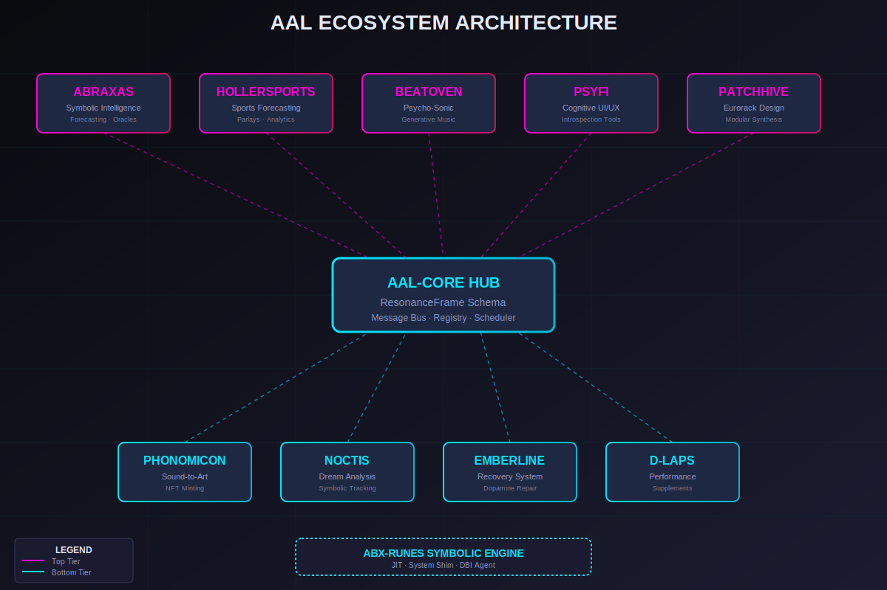

# 🏗️ AAL-Core Overview

<div align="center">



**The Brainstem of the Applied Alchemy Labs Ecosystem**

</div>

---

## 🎯 Purpose

AAL-Core is the **central coordination layer** responsible for:

<table>
<tr>
<td width="50%">

### 📡 Communication
Coordinate communication between all modules

### 🔄 Data Routing
Route symbolic and numeric data via **ResonanceFrame** schema

</td>
<td width="50%">

### 💚 Lifecycle Management
Manage health and lifecycle of subsystems

### 🔒 Constraint Enforcement
Enforce SEED and ABX-Core principles

</td>
</tr>
</table>

---

## 🧩 Components

### 1. AAL Hub
**FastAPI-based coordination service**

```
┌──────────────────────────────────────┐
│           AAL Hub                    │
├──────────────────────────────────────┤
│  • HTTP/WebSocket Endpoints          │
│  • Internal Message Bus              │
│  • Event Stream Processing           │
│  • Health Check Monitoring           │
└──────────────────────────────────────┘
```

**Key Features:**
- 🌐 RESTful API for external access
- ⚡ WebSocket support for real-time streaming
- 📨 Async message passing between modules
- 📊 Built-in observability and metrics

---

### 2. Module Adapters
**Lightweight translation connectors**

```
Module A (Native) ──▶ Adapter ──▶ ResonanceFrame ──▶ AAL Hub
```

**Purpose:**
- Translate module-specific formats into ResonanceFrame
- Handle versioning and compatibility
- Provide error handling and retries
- Enable plug-and-play module integration

---

### 3. Scheduler
**Orchestrates long-running tasks and batch jobs**

```
┌───────────────────────────────────┐
│        ERS Scheduler              │
├───────────────────────────────────┤
│  Task Queue                       │
│  ├─ Abraxas Daily Oracle          │
│  ├─ BeatOven Batch Generation     │
│  ├─ Noctis Dream Processing       │
│  └─ System Health Checks          │
└───────────────────────────────────┘
```

**Capabilities:**
- ⏰ Cron-style scheduling
- 🔁 Retry logic with exponential backoff
- 📊 Task prioritization
- 🎯 Resource allocation and throttling

---

### 4. Registry
**Catalog of available modules and capabilities**

| Field | Description |
|-------|-------------|
| **Module ID** | Unique identifier (e.g., `abraxas-v1`) |
| **Endpoints** | Available operations and APIs |
| **Capabilities** | What the module can do |
| **Status** | Health status (healthy, degraded, offline) |
| **Version** | Semantic versioning |
| **Dependencies** | Required modules or services |

---

## 🎯 Responsibilities

### 1. Modular Independence

> **Goal:** Modules can be added or removed without breaking the ecosystem

**Implementation:**
- ✅ Loose coupling via message bus
- ✅ No direct module-to-module calls
- ✅ Graceful degradation when modules are offline
- ✅ Hot-swappable module instances

---

### 2. Hardware Abstraction

> **Goal:** Minimize coupling between symbolic engines and hardware infrastructure

```
┌─────────────────────────────────────┐
│  Symbolic Layer (Modules)           │  ← High-level meaning
├─────────────────────────────────────┤
│  AAL-Core (Coordination)            │  ← Abstract interface
├─────────────────────────────────────┤
│  Hardware Layer (Tachyon 5, Cloud)  │  ← Physical execution
└─────────────────────────────────────┘
```

---

### 3. Observability

> **Goal:** Single place for monitoring, logging, and debugging

<table>
<tr>
<td width="33%">

**📊 Metrics**
- Request rates
- Error rates
- Latency (p50, p95, p99)
- Resource usage

</td>
<td width="33%">

**📝 Logging**
- Structured JSON logs
- Provenance tracking
- Error traces
- Audit trails

</td>
<td width="33%">

**🔍 Tracing**
- Distributed traces
- Request flow visualization
- Bottleneck identification
- Dependency mapping

</td>
</tr>
</table>

---

## 🚀 Future Evolution

### Phase 1: Current (Python/FastAPI)
- ✅ Rapid prototyping
- ✅ Flexible architecture
- ✅ Rich ecosystem

### Phase 2: Rust Migration (Target)
- ⚡ **Performance**: Near-native speed
- 🔒 **Safety**: Memory safety without GC
- 🎯 **Real-time**: Predictable latency
- 📦 **Embedded**: Smaller binary size for Tachyon 5

---

## 📚 Related Documentation

- [Abraxas Kernel Architecture](abraxas-kernel.md)
- [ABX-Runes Overview](abx-runes-overview.md)
- [ResonanceFrame Schema](resonanceframe-schema.md)
- [Module Interoperability](module-interoperability.md)

---

<div align="center">

**AAL-Core: Keeping complexity low-entropy and behavior predictable**

[← Back to Documentation](../../README.md)

</div>
